# Documento de Casos de Uso e Diagramas de Atividade – FitPass Gym Management

**Aluno 1:** Eric Gudera  
**Aluno 2:** Icaro Godoy  
**Disciplina:** Engenharia de Software

---

## Diagrama de Casos de Uso


---

---

## UC01 — Realizar Login

### Ator Principal
Usuário (Aluno, Recepcionista, Instrutor, Gerente)

### Objetivo
Permitir que o usuário acesse o sistema com suas credenciais.

### Pré-condições
- Usuário deve possuir cadastro ativo no sistema.

### Pós-condições
- Sessão iniciada com sucesso e usuário redirecionado para a tela correspondente ao seu perfil.

### Fluxo Principal
1. O usuário acessa a tela de login.
2. O usuário informa e-mail e senha.
3. O sistema valida as credenciais.
4. O sistema autentica o usuário e redireciona para a tela inicial conforme o perfil.

### Fluxos Alternativos
- **A1 — Senha incorreta:**  
  O sistema exibe mensagem de erro informando credenciais inválidas.
- **A2 — Conta bloqueada:**  
  O sistema impede o login e instrui o usuário a contatar o suporte.
- **A3 — Campos em branco:**  
  O sistema exibe alerta solicitando preenchimento dos campos obrigatórios.

### RF Relacionados
- RF04 — Regularidade do Aluno

### RNF Relacionados
- RNF02 — Segurança
- RNF03 — Performance
- RNF04 — Usabilidade

### RN Relacionadas
- RN06 — Acesso restrito por perfil


### Diagrama de Atividade

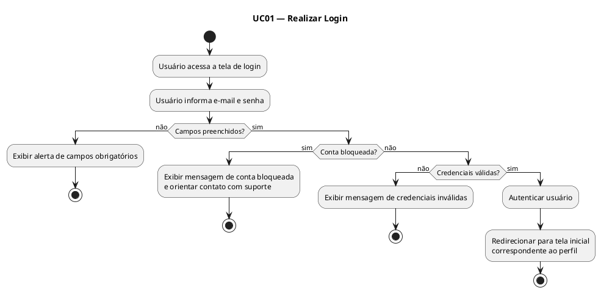

---

## UC02 — Cadastrar Aluno

### Ator Principal
Recepcionista

### Objetivo
Registrar um novo aluno no sistema com todos os dados necessários.

### Pré-condições
- Recepcionista deve estar autenticada no sistema.
- Aluno não pode possuir cadastro ativo com o mesmo CPF ou e-mail.

### Pós-condições
- Aluno cadastrado com sucesso e plano vinculado.
- Cartão RFID associado ao aluno.

### Fluxo Principal
1. A recepcionista acessa o módulo de cadastro de alunos.
2. A recepcionista preenche os dados pessoais (nome, CPF, data de nascimento, endereço, contato).
3. A recepcionista seleciona o plano desejado.
4. O sistema valida os dados informados.
5. O sistema registra o aluno e gera o cadastro.
6. A recepcionista associa o cartão RFID ao aluno.
7. O sistema confirma o cadastro.

### Fluxos Alternativos
- **A1 — CPF ou e-mail já cadastrado:**  
  O sistema exibe mensagem de erro informando duplicidade e impede o cadastro.
- **A2 — Dados incompletos:**  
  O sistema destaca os campos obrigatórios não preenchidos e solicita correção.

### RF Relacionados
- RF01 — Cadastro de Alunos
- RF05 — Controle de Acesso

### RNF Relacionados
- RNF02 — Segurança
- RNF04 — Usabilidade
- RNF05 — Escalabilidade

### RN Relacionadas
- RN06 — Acesso restrito por perfil

### Diagrama de Atividade

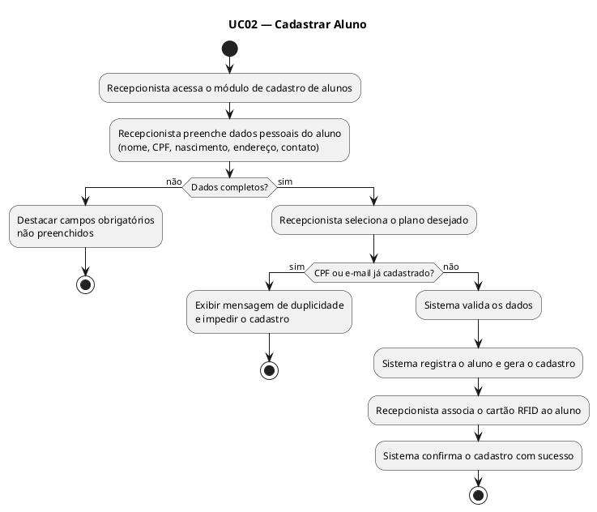

---

## UC03 — Gerenciar Planos

### Ator Principal
Gerente

### Objetivo
Criar, editar, ativar e desativar planos disponíveis na academia.

### Pré-condições
- Gerente deve estar autenticado no sistema.

### Pós-condições
- Plano criado, editado, ativado ou desativado conforme ação realizada.

### Fluxo Principal
1. O gerente acessa o módulo de gerenciamento de planos.
2. O gerente seleciona a ação desejada (criar, editar, ativar ou desativar).
3. O gerente preenche ou altera os dados do plano (nome, valor, duração, modalidade).
4. O sistema valida as informações.
5. O sistema salva as alterações e confirma a operação.

### Fluxos Alternativos
- **A1 — Plano vinculado a alunos ativos:**  
  Ao tentar desativar, o sistema exibe aviso com a quantidade de alunos vinculados e solicita confirmação.
- **A2 — Dados inválidos:**  
  O sistema exibe mensagem de erro e solicita correção.

### RF Relacionados
- RF02 — Gerenciamento de Planos

### RNF Relacionados
- RNF04 — Usabilidade
- RNF05 — Escalabilidade

### RN Relacionadas
- RN06 — Acesso restrito por perfil

### Diagrama de Atividade

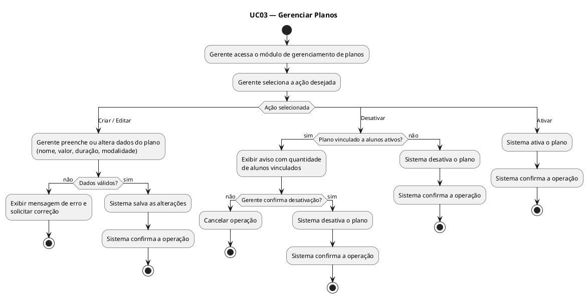

---

## UC04 — Registrar Pagamento

### Ator Principal
Recepcionista

### Objetivo
Registrar o pagamento da mensalidade de um aluno presencialmente.

### Pré-condições
- Recepcionista deve estar autenticada.
- Aluno deve possuir cadastro ativo.

### Pós-condições
- Pagamento registrado e situação do aluno atualizada para regular.

### Fluxo Principal
1. A recepcionista acessa o módulo de pagamentos.
2. A recepcionista busca o aluno pelo nome ou CPF.
3. O sistema exibe as pendências financeiras do aluno.
4. A recepcionista informa o valor e a forma de pagamento (dinheiro, cartão ou PIX).
5. O sistema valida o valor informado.
6. O sistema registra o pagamento.
7. O sistema atualiza automaticamente a situação do aluno para regular.
8. O sistema emite comprovante de pagamento.

### Fluxos Alternativos
- **A1 — Aluno não encontrado:**  
  O sistema exibe mensagem informando que o aluno não foi localizado.
- **A2 — Valor inferior ao total:**  
  O sistema exibe mensagem informando que pagamentos parciais não são permitidos.

### RF Relacionados
- RF03 — Controle de Pagamentos
- RF04 — Regularidade do Aluno

### RNF Relacionados
- RNF02 — Segurança
- RNF03 — Performance

### RN Relacionadas
- RN04 — Pagamento parcial
- RN07 — Atualização automática da regularidade

### Diagrama de Atividade

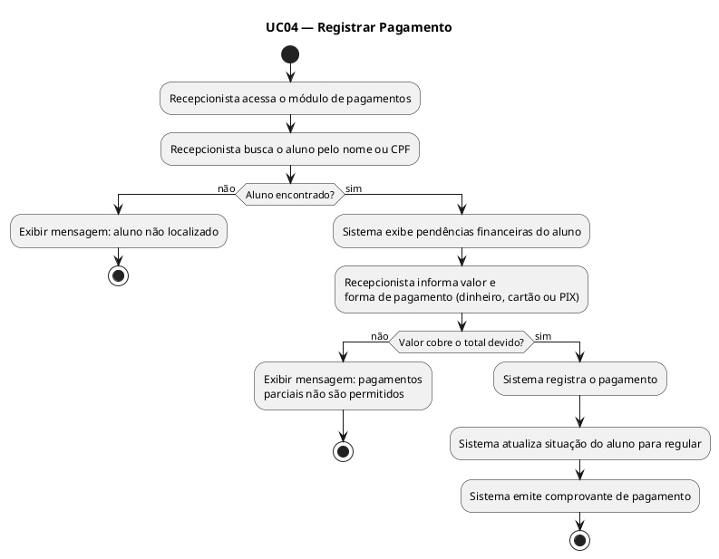

---

## UC05 — Gerar Boleto ou Link de Pagamento Online

### Ator Principal
Sistema / Aluno

### Objetivo
Gerar boleto ou link de pagamento para que o aluno quite sua mensalidade de forma online.

### Pré-condições
- Aluno deve possuir cadastro ativo.
- Deve haver mensalidade em aberto.

### Pós-condições
- Boleto ou link de pagamento gerado e enviado ao e-mail do aluno.

### Fluxo Principal
1. O aluno acessa o módulo financeiro.
2. O aluno solicita a geração de boleto ou link de pagamento.
3. O sistema verifica a mensalidade em aberto.
4. O sistema gera o boleto ou link.
5. O sistema envia o boleto ou link ao e-mail cadastrado do aluno.

### Fluxos Alternativos
- **A1 — Sem mensalidade em aberto:**  
  O sistema exibe mensagem informando que não há pendências.
- **A2 — E-mail inválido:**  
  O sistema exibe mensagem de erro e solicita atualização do e-mail.

### RF Relacionados
- RF03 — Controle de Pagamentos
- RF10 — Notificações

### RNF Relacionados
- RNF02 — Segurança
- RNF03 — Performance

### RN Relacionadas
- RN04 — Pagamento parcial
- RN07 — Atualização automática da regularidade

### Diagrama de Atividade

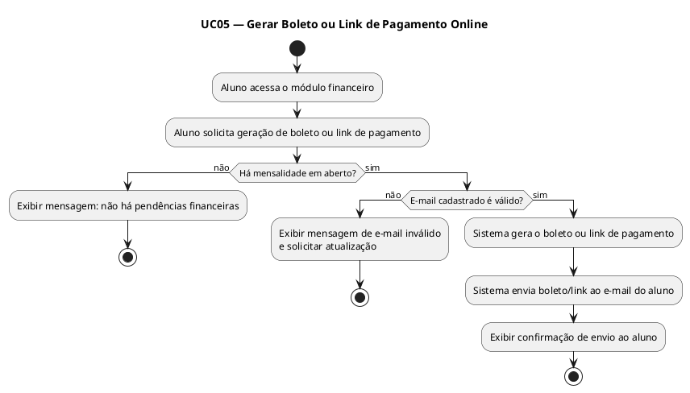

---

## UC06 — Validar Acesso pela Catraca

### Ator Principal
Sistema de Catraca (API Externa)

### Objetivo
Validar a entrada do aluno na academia por meio do cartão RFID integrado à catraca.

### Pré-condições
- Aluno deve possuir cartão RFID associado ao seu cadastro.
- Sistema de catraca deve estar integrado ao FitPass via API.

### Pós-condições
- Acesso liberado ou bloqueado conforme a situação do aluno.
- Registro de entrada gerado no histórico do aluno.

### Fluxo Principal
1. O aluno aproxima o cartão RFID à catraca.
2. A catraca envia o código RFID ao sistema via API REST.
3. O sistema identifica o aluno pelo RFID.
4. O sistema verifica se o aluno está ativo e com mensalidade em dia.
5. O sistema retorna resposta de liberação à catraca.
6. A catraca libera a entrada e registra o acesso.

### Fluxos Alternativos
- **A1 — Mensalidade vencida há mais de 5 dias:**  
  O sistema retorna bloqueio e a catraca nega a entrada.
- **A2 — RFID não cadastrado:**  
  O sistema retorna erro e a catraca nega a entrada.
- **A3 — Falha na comunicação com a API:**  
  A catraca exibe erro de comunicação e nega a entrada por segurança.

### RF Relacionados
- RF04 — Regularidade do Aluno
- RF05 — Controle de Acesso

### RNF Relacionados
- RNF01 — Disponibilidade
- RNF03 — Performance
- RNF06 — Integração

### RN Relacionadas
- RN01 — Bloqueio por inadimplência

### Diagrama de Atividade

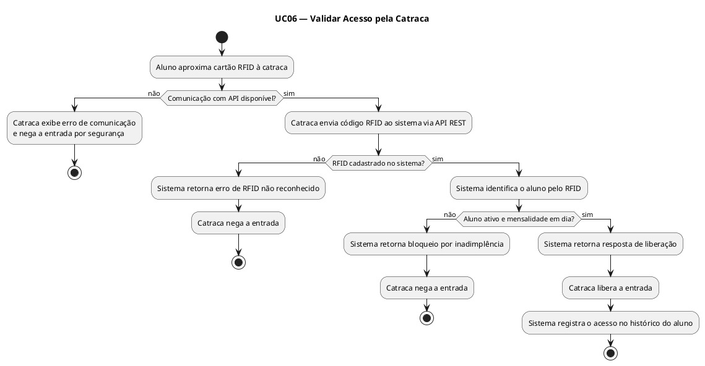

---

## UC07 — Agendar Aula

### Ator Principal
Aluno

### Objetivo
Permitir que o aluno visualize os horários disponíveis e reserve uma vaga em uma aula.

### Pré-condições
- Aluno deve estar autenticado.
- Aluno deve estar ativo e com mensalidade em dia.
- Deve haver vagas disponíveis na aula desejada.

### Pós-condições
- Reserva confirmada e vaga descontada da disponibilidade da aula.
- Notificação de confirmação enviada ao aluno.

### Fluxo Principal
1. O aluno acessa o módulo de agendamento de aulas.
2. O sistema exibe os horários e aulas disponíveis.
3. O aluno seleciona a aula e o horário desejados.
4. O sistema verifica a disponibilidade de vagas.
5. O sistema confirma a reserva.
6. O sistema envia notificação de confirmação ao aluno.

### Fluxos Alternativos
- **A1 — Aula sem vagas:**  
  O sistema exibe mensagem informando que a aula está lotada.
- **A2 — Aluno inadimplente:**  
  O sistema bloqueia o agendamento e exibe mensagem sobre pendência financeira.

### RF Relacionados
- RF06 — Agendamento de Aulas
- RF10 — Notificações

### RNF Relacionados
- RNF03 — Performance
- RNF04 — Usabilidade

### RN Relacionadas
- RN02 — Limite de vagas
- RN01 — Bloqueio por inadimplência

### Diagrama de Atividade

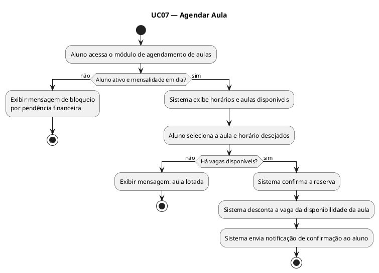

---

## UC08 — Cancelar Agendamento de Aula

### Ator Principal
Aluno

### Objetivo
Permitir que o aluno cancele uma reserva de aula previamente realizada.

### Pré-condições
- Aluno deve estar autenticado.
- Aluno deve possuir uma reserva ativa para a aula em questão.
- O cancelamento deve ser solicitado com pelo menos 1 hora de antecedência.

### Pós-condições
- Reserva cancelada e vaga devolvida à disponibilidade da aula.

### Fluxo Principal
1. O aluno acessa o módulo de agendamentos.
2. O aluno visualiza suas reservas ativas.
3. O aluno seleciona a aula que deseja cancelar.
4. O sistema verifica se o cancelamento está dentro do prazo permitido.
5. O sistema cancela a reserva.
6. O sistema atualiza a disponibilidade de vagas da aula.

### Fluxos Alternativos
- **A1 — Fora do prazo de cancelamento:**  
  O sistema exibe mensagem informando que o prazo de 1 hora antes do início da aula foi ultrapassado.
- **A2 — Reserva não encontrada:**  
  O sistema exibe mensagem informando que não há reserva ativa para a aula selecionada.

### RF Relacionados
- RF06 — Agendamento de Aulas

### RNF Relacionados
- RNF03 — Performance
- RNF04 — Usabilidade

### RN Relacionadas
- RN03 — Cancelamento de agendamento

### Diagrama de Atividade

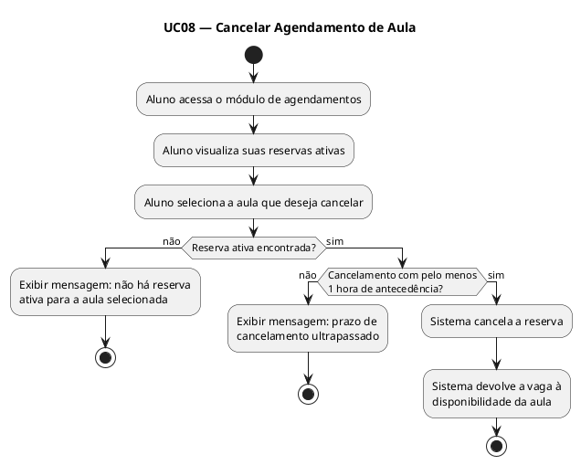

---

## UC09 — Registrar Presença em Aula

### Ator Principal
Instrutor

### Objetivo
Registrar a presença dos alunos em uma aula ministrada.

### Pré-condições
- Instrutor deve estar autenticado.
- A aula deve estar em andamento ou prestes a iniciar.

### Pós-condições
- Presença dos alunos registrada no sistema para a aula correspondente.

### Fluxo Principal
1. O instrutor acessa o módulo de presença.
2. O instrutor seleciona a aula e o horário correspondente.
3. O sistema exibe a lista de alunos com reserva confirmada.
4. O instrutor marca os alunos presentes.
5. O sistema registra a presença e salva as informações.

### Fluxos Alternativos
- **A1 — Aluno presente sem reserva:**  
  O instrutor pode adicioná-lo manualmente à lista, se houver vaga disponível.
- **A2 — Aula não encontrada:**  
  O sistema exibe mensagem de erro.

### RF Relacionados
- RF07 — Lista de Presença

### RNF Relacionados
- RNF03 — Performance
- RNF04 — Usabilidade

### RN Relacionadas
- RN06 — Acesso restrito por perfil

### Diagrama de Atividade

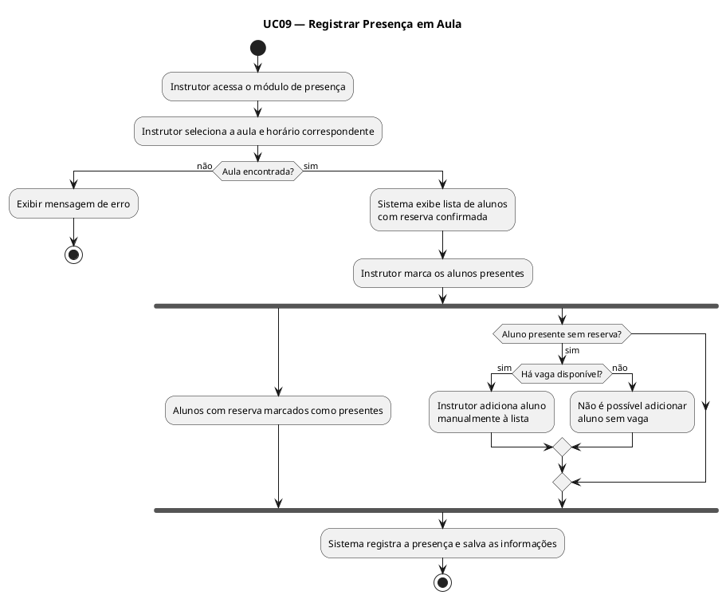

---

## UC10 — Realizar Avaliação Física

### Ator Principal
Instrutor

### Objetivo
Registrar os dados da avaliação física de um aluno.

### Pré-condições
- Instrutor deve estar autenticado.
- Aluno deve estar ativo e com mensalidade em dia.

### Pós-condições
- Avaliação física registrada com os dados do aluno e disponível para consulta.

### Fluxo Principal
1. O instrutor acessa o módulo de avaliações físicas.
2. O instrutor busca o aluno pelo nome ou CPF.
3. O sistema verifica se o aluno está ativo e regular.
4. O instrutor preenche os dados da avaliação (peso, altura, IMC, percentual de gordura, etc.).
5. O instrutor pode anexar arquivos complementares.
6. O sistema salva a avaliação e registra a data.
7. O sistema notifica o aluno sobre a nova avaliação disponível.

### Fluxos Alternativos
- **A1 — Aluno inadimplente:**  
  O sistema bloqueia a avaliação e exibe mensagem informando a pendência.
- **A2 — Aluno inativo:**  
  O sistema bloqueia a avaliação e exibe mensagem de cadastro inativo.

### RF Relacionados
- RF08 — Avaliação Física
- RF10 — Notificações

### RNF Relacionados
- RNF02 — Segurança
- RNF04 — Usabilidade

### RN Relacionadas
- RN05 — Avaliação física
- RN06 — Acesso restrito por perfil

### Diagrama de Atividade

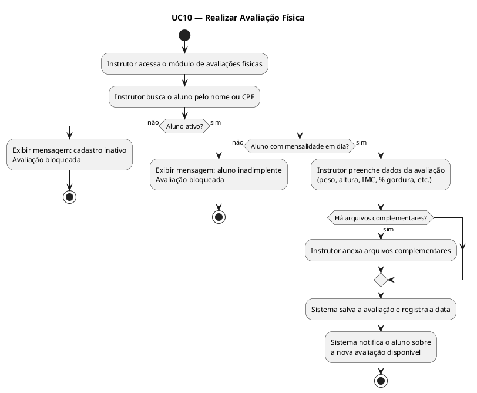

---

## UC11 — Consultar Histórico de Avaliações Físicas

### Ator Principal
Aluno / Instrutor

### Objetivo
Permitir a consulta ao histórico de avaliações físicas de um aluno.

### Pré-condições
- Usuário deve estar autenticado.
- Deve existir ao menos uma avaliação registrada para o aluno.

### Pós-condições
- Histórico de avaliações exibido com dados e datas correspondentes.

### Fluxo Principal
1. O usuário acessa o módulo de avaliações físicas.
2. O sistema exibe o histórico de avaliações do aluno em ordem cronológica.
3. O usuário seleciona uma avaliação para visualizar detalhes.
4. O sistema exibe todos os dados e arquivos anexados da avaliação selecionada.

### Fluxos Alternativos
- **A1 — Sem avaliações registradas:**  
  O sistema exibe mensagem informando que não há avaliações no histórico.

### RF Relacionados
- RF08 — Avaliação Física

### RNF Relacionados
- RNF02 — Segurança
- RNF03 — Performance

### RN Relacionadas
- RN05 — Avaliação física
- RN06 — Acesso restrito por perfil

### Diagrama de Atividade

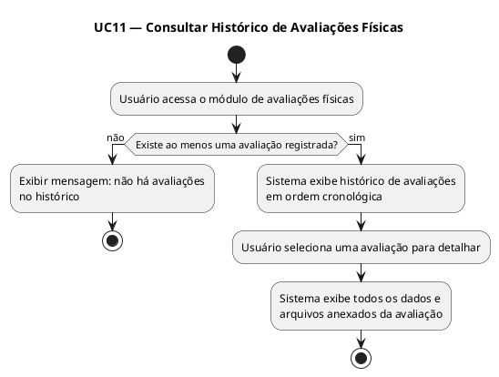

---

## UC12 — Emitir Relatório de Inadimplência

### Ator Principal
Gerente

### Objetivo
Gerar relatório com todos os alunos com mensalidade em atraso.

### Pré-condições
- Gerente deve estar autenticado.

### Pós-condições
- Relatório de inadimplência gerado com dados atualizados.

### Fluxo Principal
1. O gerente acessa o módulo de relatórios.
2. O gerente seleciona o relatório de inadimplência.
3. O gerente define os filtros desejados (período, unidade, plano).
4. O sistema processa os dados e gera o relatório.
5. O sistema exibe o relatório com a lista de alunos inadimplentes, valor devido e dias em atraso.
6. O gerente pode exportar o relatório em PDF ou CSV.

### Fluxos Alternativos
- **A1 — Sem dados para o período selecionado:**  
  O sistema exibe mensagem informando que não há inadimplentes no período.

### RF Relacionados
- RF09 — Relatórios Gerenciais

### RNF Relacionados
- RNF03 — Performance
- RNF05 — Escalabilidade

### RN Relacionadas
- RN01 — Bloqueio por inadimplência
- RN06 — Acesso restrito por perfil

### Diagrama de Atividade

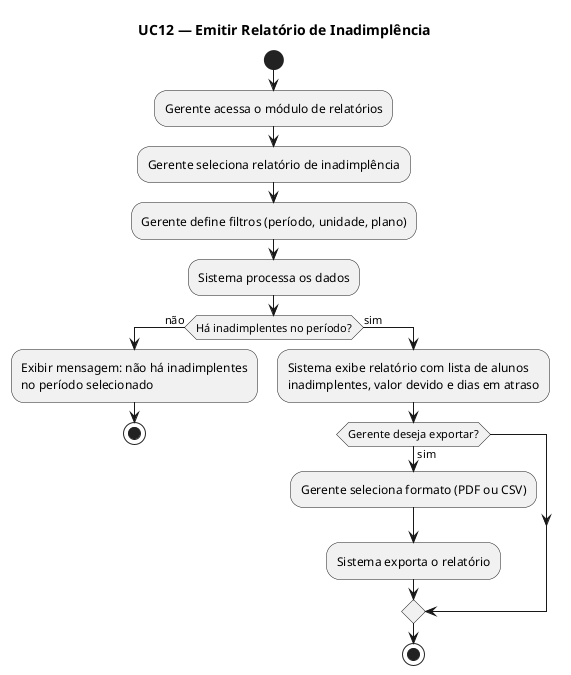

---

## UC13 — Emitir Relatório de Alunos Ativos

### Ator Principal
Gerente

### Objetivo
Gerar relatório com todos os alunos ativos na academia.

### Pré-condições
- Gerente deve estar autenticado.

### Pós-condições
- Relatório de alunos ativos gerado com informações atualizadas.

### Fluxo Principal
1. O gerente acessa o módulo de relatórios.
2. O gerente seleciona o relatório de alunos ativos.
3. O gerente aplica filtros opcionais (plano, data de matrícula, unidade).
4. O sistema gera o relatório com nome, plano e data de vencimento de cada aluno.
5. O gerente pode exportar o relatório.

### Fluxos Alternativos
- **A1 — Nenhum aluno ativo:**  
  O sistema exibe mensagem informando que não há alunos ativos com os filtros aplicados.

### RF Relacionados
- RF09 — Relatórios Gerenciais

### RNF Relacionados
- RNF03 — Performance
- RNF05 — Escalabilidade

### RN Relacionadas
- RN06 — Acesso restrito por perfil

### Diagrama de Atividade

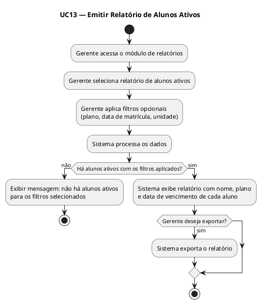

---

## UC14 — Emitir Relatório de Histórico de Acessos

### Ator Principal
Gerente

### Objetivo
Gerar relatório com o histórico de entradas registradas pela catraca.

### Pré-condições
- Gerente deve estar autenticado.

### Pós-condições
- Relatório de acessos gerado com informações por período e aluno.

### Fluxo Principal
1. O gerente acessa o módulo de relatórios.
2. O gerente seleciona o relatório de histórico de acessos.
3. O gerente define o período e opcionalmente filtra por aluno ou unidade.
4. O sistema processa os registros de acesso e gera o relatório.
5. O gerente visualiza o relatório com data, hora e nome do aluno.
6. O gerente pode exportar o relatório.

### Fluxos Alternativos
- **A1 — Sem acessos no período:**  
  O sistema exibe mensagem informando que não há registros para os filtros selecionados.

### RF Relacionados
- RF05 — Controle de Acesso
- RF09 — Relatórios Gerenciais

### RNF Relacionados
- RNF03 — Performance
- RNF05 — Escalabilidade

### RN Relacionadas
- RN06 — Acesso restrito por perfil

### Diagrama de Atividade

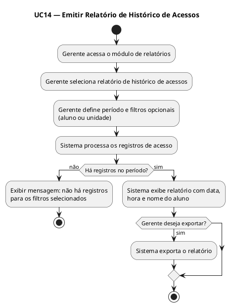

---

## UC15 — Emitir Relatório de Ocupação das Aulas

### Ator Principal
Gerente

### Objetivo
Gerar relatório com a taxa de ocupação de cada aula no período selecionado.

### Pré-condições
- Gerente deve estar autenticado.

### Pós-condições
- Relatório de ocupação das aulas gerado e disponível para exportação.

### Fluxo Principal
1. O gerente acessa o módulo de relatórios.
2. O gerente seleciona o relatório de ocupação das aulas.
3. O gerente define o período e os filtros desejados.
4. O sistema calcula a taxa de ocupação por aula com base nos agendamentos e presenças.
5. O sistema exibe o relatório com aula, instrutor, capacidade, reservas e presença efetiva.
6. O gerente pode exportar o relatório.

### Fluxos Alternativos
- **A1 — Sem aulas no período:**  
  O sistema exibe mensagem informando que não há dados para o período selecionado.

### RF Relacionados
- RF06 — Agendamento de Aulas
- RF07 — Lista de Presença
- RF09 — Relatórios Gerenciais

### RNF Relacionados
- RNF03 — Performance
- RNF05 — Escalabilidade

### RN Relacionadas
- RN02 — Limite de vagas
- RN06 — Acesso restrito por perfil

### Diagrama de Atividade

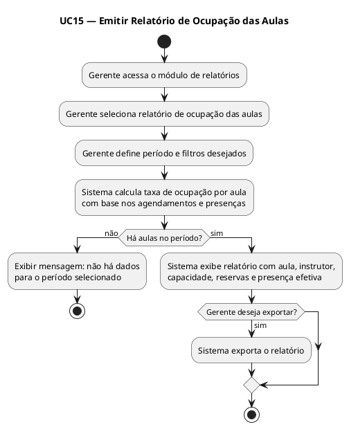

---

## UC16 — Enviar Notificação de Vencimento de Mensalidade

### Ator Principal
Sistema

### Objetivo
Notificar automaticamente o aluno sobre o vencimento próximo ou ocorrido da mensalidade.

### Pré-condições
- Aluno deve possuir cadastro ativo com e-mail válido.
- A mensalidade deve estar próxima do vencimento ou já vencida.

### Pós-condições
- Notificação enviada ao aluno por e-mail e registrada no histórico.

### Fluxo Principal
1. O sistema verifica diariamente os vencimentos de mensalidades.
2. O sistema identifica alunos com vencimento nos próximos 3 dias ou já vencido.
3. O sistema gera a notificação personalizada com o valor e a data de vencimento.
4. O sistema envia a notificação ao e-mail do aluno.
5. O sistema registra o envio da notificação no histórico.

### Fluxos Alternativos
- **A1 — E-mail inválido ou não cadastrado:**  
  O sistema registra o erro de envio e marca a notificação como pendente.

### RF Relacionados
- RF10 — Notificações

### RNF Relacionados
- RNF01 — Disponibilidade
- RNF03 — Performance

### RN Relacionadas
- RN01 — Bloqueio por inadimplência
- RN07 — Atualização automática da regularidade

### Diagrama de Atividade

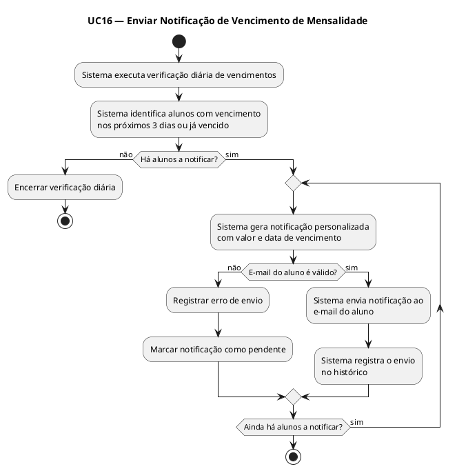

---

## UC17 — Atualizar Dados Cadastrais do Aluno

### Ator Principal
Recepcionista / Aluno

### Objetivo
Permitir a atualização dos dados cadastrais de um aluno.

### Pré-condições
- Usuário deve estar autenticado.
- Aluno deve possuir cadastro ativo.

### Pós-condições
- Dados do aluno atualizados e salvos no sistema.

### Fluxo Principal
1. O usuário acessa o módulo de cadastro.
2. O usuário localiza o aluno pelo nome ou CPF (recepcionista) ou acessa o próprio perfil (aluno).
3. O sistema exibe os dados atuais do aluno.
4. O usuário edita os campos desejados.
5. O sistema valida os dados alterados.
6. O sistema salva as alterações e exibe confirmação.

### Fluxos Alternativos
- **A1 — E-mail já cadastrado para outro aluno:**  
  O sistema exibe mensagem de conflito e solicita correção.
- **A2 — Dados inválidos:**  
  O sistema destaca os campos com erro e solicita correção.

### RF Relacionados
- RF01 — Cadastro de Alunos

### RNF Relacionados
- RNF02 — Segurança
- RNF04 — Usabilidade

### RN Relacionadas
- RN06 — Acesso restrito por perfil

### Diagrama de Atividade

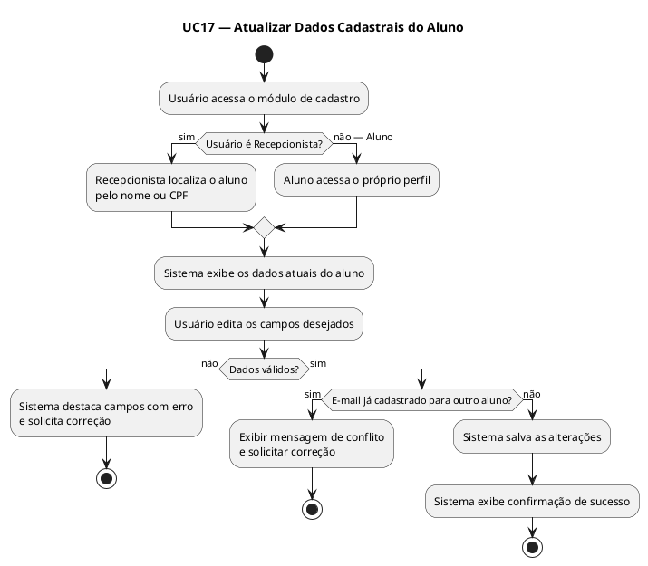

---

## UC18 — Inativar Cadastro de Aluno

### Ator Principal
Recepcionista

### Objetivo
Inativar o cadastro de um aluno que não deseja mais utilizar os serviços da academia.

### Pré-condições
- Recepcionista deve estar autenticada.
- Aluno deve possuir cadastro ativo.

### Pós-condições
- Cadastro do aluno marcado como inativo e acesso bloqueado no sistema e na catraca.

### Fluxo Principal
1. A recepcionista acessa o módulo de cadastro de alunos.
2. A recepcionista localiza o aluno pelo nome ou CPF.
3. A recepcionista seleciona a opção de inativar cadastro.
4. O sistema exibe tela de confirmação informando as consequências da ação.
5. A recepcionista confirma a inativação.
6. O sistema marca o aluno como inativo e bloqueia seu acesso.

### Fluxos Alternativos
- **A1 — Aluno com pendências financeiras:**  
  O sistema exibe aviso sobre pendências e solicita confirmação adicional.
- **A2 — Recepcionista cancela a ação:**  
  O sistema retorna à tela anterior sem realizar alterações.

### RF Relacionados
- RF01 — Cadastro de Alunos
- RF05 — Controle de Acesso

### RNF Relacionados
- RNF02 — Segurança

### RN Relacionadas
- RN06 — Acesso restrito por perfil

### Diagrama de Atividade

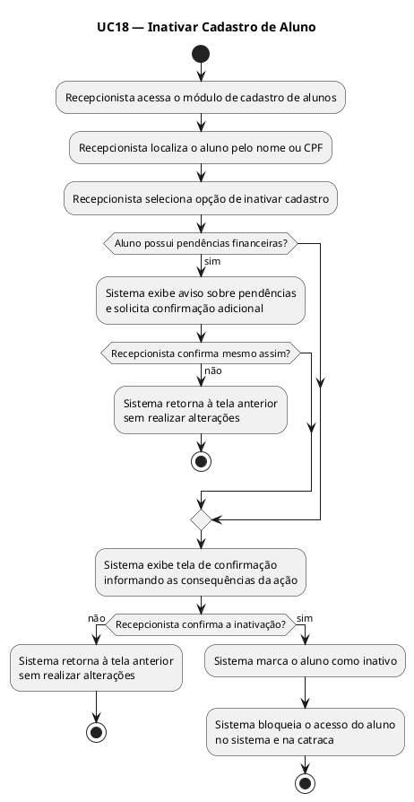

---

## UC19 — Consultar Agendamentos do Aluno

### Ator Principal
Aluno / Recepcionista

### Objetivo
Visualizar todos os agendamentos ativos e histórico de aulas reservadas pelo aluno.

### Pré-condições
- Usuário deve estar autenticado.

### Pós-condições
- Lista de agendamentos exibida ao usuário.

### Fluxo Principal
1. O usuário acessa o módulo de agendamentos.
2. O sistema exibe os agendamentos futuros confirmados do aluno.
3. O usuário pode alternar para visualizar o histórico de aulas passadas.
4. O sistema exibe as informações de cada aula (nome, instrutor, data, horário e status).

### Fluxos Alternativos
- **A1 — Sem agendamentos:**  
  O sistema exibe mensagem informando que não há reservas ativas ou histórico disponível.

### RF Relacionados
- RF06 — Agendamento de Aulas
- RF07 — Lista de Presença

### RNF Relacionados
- RNF03 — Performance
- RNF04 — Usabilidade

### RN Relacionadas
- RN03 — Cancelamento de agendamento

### Diagrama de Atividade

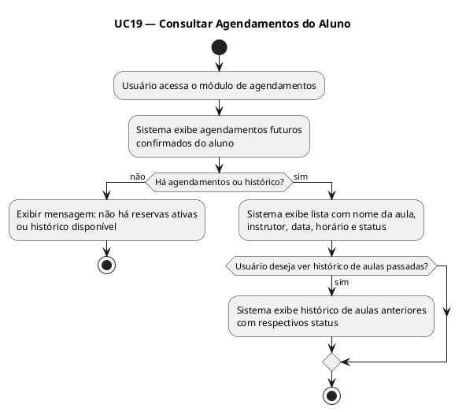

---

## UC20 — Recuperar Senha

### Ator Principal
Usuário (Aluno, Recepcionista, Instrutor, Gerente)

### Objetivo
Permitir que o usuário redefina sua senha em caso de esquecimento.

### Pré-condições
- Usuário deve possuir cadastro ativo com e-mail válido.

### Pós-condições
- Nova senha definida e usuário apto a realizar login com as novas credenciais.

### Fluxo Principal
1. O usuário acessa a tela de login e clica em "Esqueci minha senha".
2. O usuário informa o e-mail cadastrado.
3. O sistema verifica se o e-mail está associado a um cadastro ativo.
4. O sistema envia um link de redefinição de senha ao e-mail informado.
5. O usuário acessa o link recebido.
6. O usuário informa a nova senha e confirma.
7. O sistema valida e atualiza a senha.
8. O sistema exibe mensagem de sucesso e redireciona para a tela de login.

### Fluxos Alternativos
- **A1 — E-mail não cadastrado:**  
  O sistema exibe mensagem genérica de que, se o e-mail existir, o link será enviado (segurança).
- **A2 — Link expirado:**  
  O sistema informa que o link expirou e orienta o usuário a solicitar um novo.
- **A3 — Senhas não coincidem:**  
  O sistema exibe mensagem de erro e solicita que o usuário preencha os campos novamente.

### RF Relacionados
- RF04 — Regularidade do Aluno

### RNF Relacionados
- RNF02 — Segurança
- RNF04 — Usabilidade

### RN Relacionadas
- RN06 — Acesso restrito por perfil

### Diagrama de Atividade

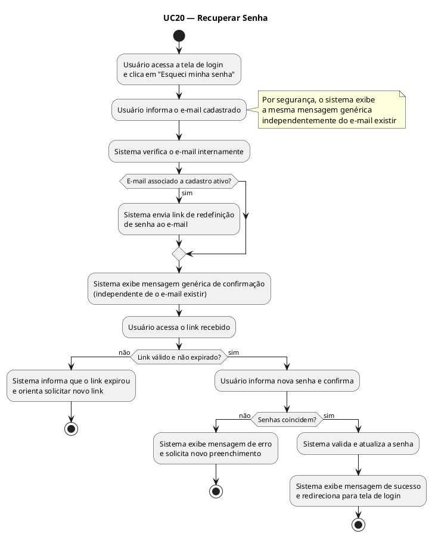

---

## UC21 — Gerenciar Horários de Aulas

### Ator Principal
Gerente / Instrutor

### Objetivo
Cadastrar, editar e remover horários e turmas de aulas disponíveis na academia.

### Pré-condições
- Usuário deve estar autenticado com perfil de Gerente ou Instrutor.

### Pós-condições
- Horário de aula criado, editado ou removido e refletido na agenda de agendamentos dos alunos.

### Fluxo Principal
1. O usuário acessa o módulo de gerenciamento de aulas.
2. O usuário seleciona a ação desejada (criar, editar ou remover turma).
3. O usuário preenche ou altera os dados da aula (nome, modalidade, instrutor responsável, dias da semana, horário de início, duração e capacidade máxima).
4. O sistema valida as informações.
5. O sistema salva as alterações e confirma a operação.
6. A aula passa a aparecer (ou deixa de aparecer) na agenda de agendamentos dos alunos.

### Fluxos Alternativos
- **A1 — Conflito de horário com outra turma do mesmo instrutor:**  
  O sistema exibe alerta informando o conflito e solicita que o usuário ajuste o horário.
- **A2 — Remoção de aula com alunos agendados:**  
  O sistema exibe aviso com a quantidade de alunos afetados e solicita confirmação antes de prosseguir.

### RF Relacionados
- RF02 — Gerenciamento de Planos
- RF06 — Agendamento de Aulas

### RNF Relacionados
- RNF04 — Usabilidade
- RNF05 — Escalabilidade

### RN Relacionadas
- RN02 — Limite de vagas
- RN06 — Acesso restrito por perfil

### Diagrama de Atividade

```plantuml
@startuml UC21_GerenciarHorarios
title UC21 — Gerenciar Horários de Aulas

start

:Usuário acessa o módulo de gerenciamento de aulas;

:Usuário seleciona a ação desejada;

switch (Ação selecionada)
case (Criar / Editar)
  :Usuário preenche ou altera dados da aula\n(nome, modalidade, instrutor, dias,\nhorário, duração, capacidade);
  if (Conflito de horário com outra\nturma do mesmo instrutor?) then (sim)
    :Sistema exibe alerta de conflito\ne solicita ajuste de horário;
    stop
  else (não)
    :Sistema valida as informações;
    :Sistema salva e confirma a operação;
    :Aula atualizada na agenda dos alunos;
    stop
  endif
case (Remover)
  if (Há alunos agendados na aula?) then (sim)
    :Sistema exibe aviso com quantidade\nde alunos afetados;
    if (Usuário confirma a remoção?) then (não)
      :Cancelar operação;
      stop
    else (sim)
      :Sistema remove a aula;
      :Aula removida da agenda dos alunos;
      stop
    endif
  else (não)
    :Sistema remove a aula;
    :Aula removida da agenda dos alunos;
    stop
  endif
endswitch

@enduml
```

---

## Diagrama de Atividade Agrupado — Fluxo de Pagamento (UC04, UC05, UC16)

> Diagrama adicional contemplando o fluxo completo de controle financeiro: registro presencial, geração de boleto online e notificação automática de vencimento.

```plantuml
@startuml GrupoA_FluxoPagamento
title Fluxo Integrado de Pagamento — UC04, UC05, UC16

start

:Sistema verifica diariamente vencimentos\nde mensalidades (UC16);

fork
  :Aluno com vencimento próximo\nou já vencido identificado;
  :Sistema envia notificação de\nvencimento por e-mail (UC16);
  :Aluno recebe notificação;
  if (Aluno opta por pagar online?) then (sim)
    :Aluno solicita geração de\nboleto ou link (UC05);
    if (Há mensalidade em aberto?) then (sim)
      :Sistema gera boleto/link\ne envia ao e-mail;
      :Aluno realiza pagamento online;
      :Sistema registra pagamento\ne atualiza situação para regular;
    endif
  endif
fork again
  :Aluno se dirige à recepção;
  :Recepcionista registra pagamento\npresencialmente (UC04);
  :Sistema valida valor e\nforma de pagamento;
  :Sistema registra pagamento\ne emite comprovante;
  :Sistema atualiza situação\ndo aluno para regular;
end fork

stop

@enduml
```

---

## Diagrama de Atividade Agrupado — Fluxo de Acesso e Presença (UC06, UC07, UC08, UC09)

> Diagrama adicional contemplando o ciclo completo de participação do aluno nas aulas: agendamento, cancelamento, acesso pela catraca e registro de presença.

```plantuml
@startuml GrupoB_FluxoAcessoPresenca
title Fluxo de Acesso e Presença nas Aulas — UC06, UC07, UC08, UC09

start

:Aluno visualiza horários disponíveis;

if (Aluno ativo e mensalidade em dia?) then (não)
  :Bloqueio de agendamento por\ninadimplência (UC07);
  stop
else (sim)
  :Aluno realiza agendamento (UC07);
  if (Aluno deseja cancelar?) then (sim)
    if (Dentro do prazo de 1h?) then (sim)
      :Aluno cancela agendamento (UC08);
      :Vaga devolvida à aula;
      stop
    else (não)
      :Cancelamento bloqueado (UC08);
    endif
  endif

  :No dia da aula, aluno se dirige à academia;

  :Aluno aproxima RFID à catraca (UC06);
  if (Acesso liberado?) then (não)
    :Catraca nega entrada (UC06);
    stop
  else (sim)
    :Catraca libera entrada e\nregistra acesso (UC06);
    :Aluno participa da aula;
    :Instrutor registra presença\ndo aluno (UC09);
    stop
  endif
endif

@enduml
```
